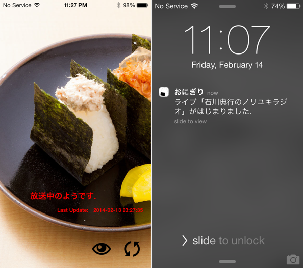
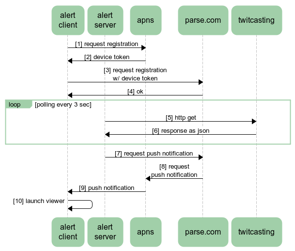

Onigiri Alert Server
==
implementation of rapid push notification for specified user's twitcasting live.

* server implementation: https://github.com/honishi/onigiri-alert-server
* client implementation: https://github.com/honishi/onigiri-alert-client

binary available at [App Store](https://itunes.apple.com/jp/app/onigiri/id821353463).

sample
--


sequence overview
--


requirements
--
* account for parse
    * https://parse.com
* python runtime environment
    * pyenv
        * https://github.com/yyuu/pyenv
        * python 3.3.x
    * pyenv-virtualenv
        * https://github.com/yyuu/pyenv-virtualenv

setup
--
first, setup python runtime environment.
````
pyenv install 3.3.3
pyenv virtualenv 3.3.3 onigirialert-venv-3.3.3
pip install -r requirements.txt
````

then application specific settings.
````
cp onigiri.config.sample onigiri.config
edit onigiri.config
cp onigiri.env.sample onigiri.env
edit onigiri.env
````

start & stop
--
just use start and stop.
````
./onigiri.sh start
./onigiri.sh stop
````

monitoring example using cron
--
see `onigiri.sh` inside for details of monitoring.
````
* * * * * /path/to/onigiri-alert-server/onigiri.sh monitor >> /path/to/onigiri-alert-server/log/monitor.log 2>&1
````

license
--
copyright &copy; 2014- honishi, hiroyuki onishi.

distributed under the [MIT license][mit].
[mit]: http://www.opensource.org/licenses/mit-license.php
