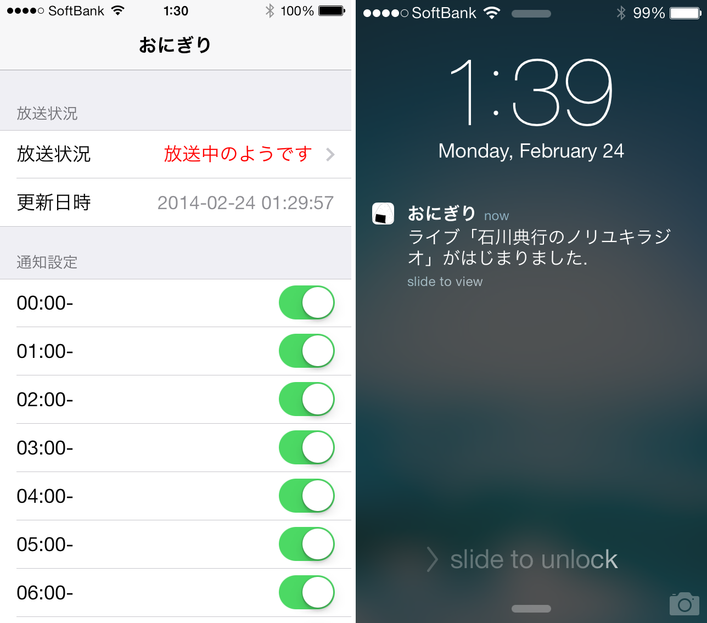

Onigiri Alert Server
==
implementation of rapid push notification for specified user's twitcasting live.

* server implementation: https://github.com/honishi/onigiri-alert-server
* client implementation: https://github.com/honishi/onigiri-alert-client

sample
--


sequence overview
--


requirements
--
* account for Parse
* python runtime environment
    * pyenv
        * python 3.3.x
    * pyenv-virtualenv

setup
--
````
pyenv install 3.3.3
pyenv virtualenv 3.3.3 onigirialert-venv-3.3.3
pip install -r requirements.txt
````

start & stop
--
````
./onigiri.sh start
and
./onigiri.sh stop
````

monitoring example using cron
--
````
* * * * * /path/to/onigiri-alert-server/onigiri.sh monitor >> /path/to/onigiri-alert-server/log/monitor.log 2>&1
````
see `onigiri.sh` inside for the details of monitoring.

license
--
copyright &copy; 2014- honishi, hiroyuki onishi.

distributed under the [MIT license][mit].
[mit]: http://www.opensource.org/licenses/mit-license.php
